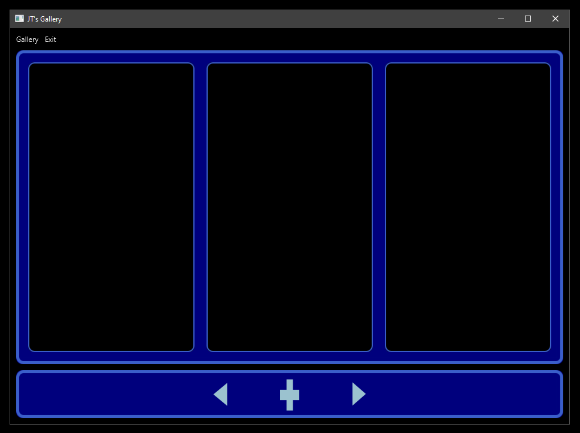
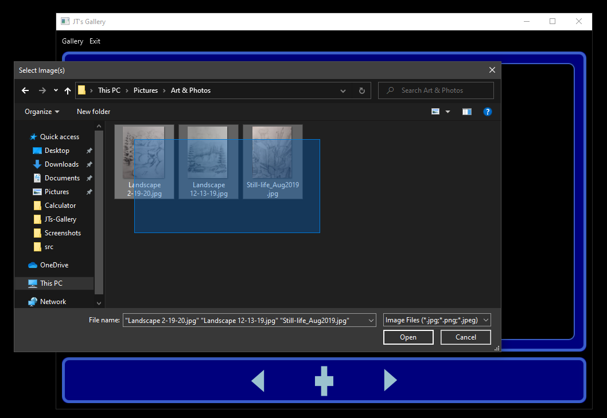
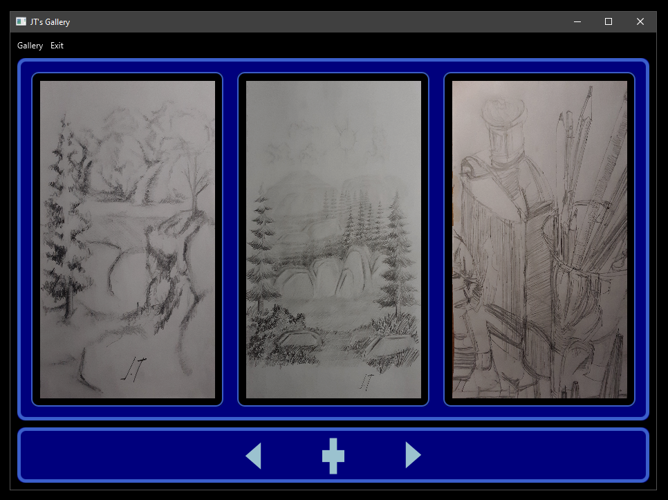

# JTs-Gallery
JT's Gallery is a personal project. This project is an image gallery application developed in Java and JavaFX.

<h2>DEMO</h2>

<table>
<td></td>
<td></td>
<td></td>
</table>

<h2>REQUIREMENTS</h2>
<ol>
  <li>Java Development Kit (version 16.0.1) (OpenJDK) (Source: https://jdk.java.net/16/)</li>
  <li>JavaFX Development Kit (version 11.0.2) (OpenJFX) (Source: https://openjfx.io/)</li>
  </ol>
  

<h2>RUNNING THE IMAGE GALLERY</h2>
<ol>
  <li>Download the project (.zip folder) or clone the repository locally on your machine. Also make sure that you have downloaded both Java SDKs to your system.</li>
  <li>Make sure you have Java set to run on your computer.</li> 
  <i>(Example with Windows:)</i> 
  <ul>
    
  <li>Go to Control Panel-->All Control Panel Items-->System-->Advanced System Settings-->Environment Variables</li>
  <li>Depending on where your standard JDK is installed, click Edit on either your user or system path variables and add a new directory with the location of your JDK</li>
  </ul>
   
  <li>Navigate to the project's root directory (/JTs-Gallery/..)</li>
  <li>Open your system's command-line interface, input the following commands and press Enter:
  
    java -classpath ./bin --module-path "<YOUR PATH TO JAVAFX SDK>/lib" --add-modules javafx.controls -jar gallery.jar
  </li>
  </ol>
